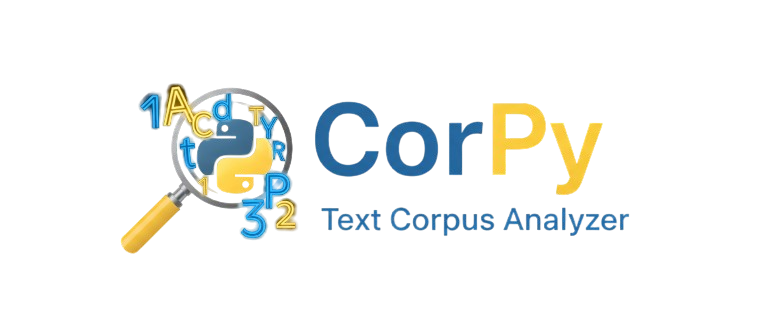
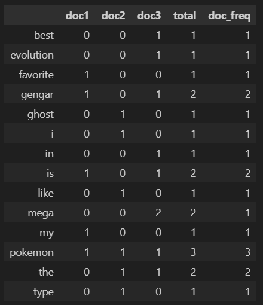
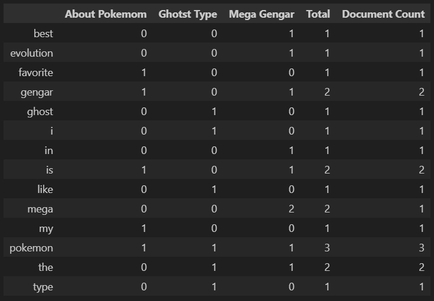

<p align="center">
  
</p>

# 📚 Corpy - Text Corpus Analyzer


[](https://opensource.org/licenses/MIT)

**Corpy** is a minimalist Python library for quantitative analysis of text corpora.  
Designed for efficient processing of document collections, it provides essential metrics about vocabulary and word distribution.

## 🎯 Purpose

The true value of **Corpy** lies in its simplicity and complete independence. It is an elegant, lightweight, and educational piece of code that demonstrates how text analysis can be performed using pure Python, without relying on external libraries. Corpy is like a Swiss Army knife: lightweight, portable, and perfect for quick scripts, restricted environments, or teaching basic text processing concepts. You can take it anywhere without hassle.

### 🚫 Restricted Environments: One of Its Greatest Strengths

Corpy truly shines in scenarios where installing external dependencies is not possible or not desirable, such as:

- **Serverless Functions (AWS Lambda, Google Cloud Functions):** Keeping the deployment package small and free of complex dependencies reduces costs and startup times.
- **Embedded Systems or IoT:** Ideal for devices with very limited resources (memory, storage), where installing large libraries is not feasible.
- **Secure or Corporate IT Environments:** Perfect for settings where installing third-party packages is restricted or prohibited by security policies.

Corpy is the ideal tool for those seeking efficiency, portability, and clarity in text analysis.

## 📖 Simple usage example
**Import and create a Corpy object** using a list of strings as an input parameter for the Corpy class
```python
from corpy import Corpy

corpus = [
    "gengar is my favorite pokemon",
    "i like the ghost type pokemon",
    "mega gengar is the best mega evolution in pokemon"
]

corpy = Corpy(corpus)
```
Now, show some things about the corpus.
```python
print("--- Data of some words ---")
print("The word 'pokemon' appears in", corpy.data['pokemon']['doc_freq'], "documents")
print("The word 'mega' appears in doc3", corpy.data['mega']['doc3'], "times")
print("All stats about 'gengar':", corpy.data['gengar'])
```
Output:
```python
--- Data of some words ---
The word 'pokemon' appears in 3 documents
The word 'mega' appears in doc3 2 times
All stats about 'gengar': {'doc1': 1, 'doc2': 0, 'doc3': 1, 'total': 2, 'doc_freq': 2}
```


⚠️ *Note: Example taken from [**Getting Started Guide**](https://github.com/Ariiies/corpy/blob/main/docs/getting_started.md).*

## 📖 Integration with Pandas
For better data visualization, integrating with pandas is very simple:
```python
import pandas as pd

df = pd.DataFrame.from_dict(corpy.data, orient='index')
print(df)
```
Output:

<p align="center">
  
</p>

**And to have a better reference in the columns:**
```python
new_columns = {
    'doc1': 'About Pokemom',
    'doc2': 'Ghotst Type',
    'doc3': 'Mega Gengar',
    'total': 'Total',
    'doc_freq': 'Document Count'
}

new_df= df.rename(columns=new_columns)
print(new_df)
```
Output:
<p align="center">
  
</p>

## ✨ Features

- Automatic vocabulary extraction  
- Lexical frequency statistics  
- Per-document and global metrics  
- Intuitive interface using property getters  
- Clear and structured output  
- Efficient implementation using pure Python

## 🔍 Access to Key Metrics

### ▸ `.vocabulary`
**Unique Vocabulary**  
Alphabetically sorted list of all distinct words in the corpus.

### ▸ `.data`
**Lexical Frequencies**  
Dictionary containing:
- ✓ Word count per document (`doc1`, `doc2`, ...)
- ✓ Total word occurrences
- ✓ Document frequency (how many documents contain the word)

### ▸ `.doc_data`
**Document Statistics**  
Includes:
- ✓ Word count per document
- ✓ Total number of words across the corpus

### ▸ `.summary()`
**Global Overview**  
Summary including:
- ✓ Number of documents
- ✓ Vocabulary size
- ✓ Average words per document

---

## 📖 Usage & Documentation

Looking to get started?  
Check out the [**Getting Started Guide**](https://github.com/Ariiies/corpy/blob/main/docs/getting_started.md) for installation instructions, examples, and full API reference.

To learn more about Corpy, check  [<span style="font-size:1em; font-weight:600">Showcases and more reference.</span> ](https://github.com/Ariiies/corpy/blob/main/docs/showcase.md)

---

## 📊 Main Metrics Table

| Method/Property  | Description                                  | Output Type              |
|------------------|----------------------------------------------|--------------------------|
| `vocabulary`     | Ordered list of unique words                 | `list[str]`              |
| `data`           | Detailed word-level statistics               | `dict[str, dict]`        |
| `doc_data`       | Word counts per document                     | `dict[str, dict]`        |
| `summary()`      | Aggregated metrics for the corpus            | `dict[str, int/float]`   |

---

## 🖥 Technical Requirements

- **Python 3.7+**
- **Zero-dependencies** – Implemented in pure Python
- **Cross-platform** – Compatible with Windows, Linux, and macOS

---

## 📜 License
MIT © Luis Aries Meza Castillo – A tool for computational linguistic analysis
